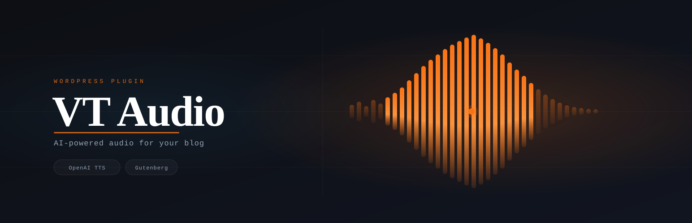

# VT Audio

A single-file WordPress plugin that generates AI-narrated audio versions of your posts using OpenAI TTS and embeds a lightweight, accessible audio player.



## Features

- Generates an MP3 from post content with one click via a sidebar meta box
- Stores audio in the WordPress media library — no external hosting needed
- Custom front-end player injected above post content, inheriting your theme's light/dark mode
- Handles OpenAI's 4096-character limit by chunking at sentence boundaries
- Strips Gutenberg block comments, code blocks, images, and shortcodes before sending to TTS
- Skips posts under a configurable word count and image/gallery post formats
- Fully accessible: ARIA labels, dynamic button states, `:focus-visible` outlines

## Requirements

- WordPress 6.0+
- PHP 7.4+
- An [OpenAI API key](https://platform.openai.com/api-keys) with TTS access

## Installation

1. Download the latest `vt-audio.zip` from [Releases](../../releases)
2. In wp-admin go to **Plugins → Add New → Upload Plugin**
3. Upload the zip and activate
4. Go to **Settings → VT Audio** and enter your OpenAI API key

## Configuration

| Setting | Default | Options |
|---|---|---|
| OpenAI API Key | — | Your secret key |
| Model | `tts-1-hd` | `tts-1`, `tts-1-hd` |
| Voice | `nova` | alloy, echo, fable, nova, onyx, shimmer |
| Minimum word count | `300` | Any integer |

## Usage

Open any post in the editor. In the **Audio Version** sidebar panel, click **Generate Audio**. The plugin sends the cleaned post content to OpenAI TTS, saves the resulting MP3 to your media library, and links it to the post. The player appears automatically above the post content on the front end.

To regenerate audio after editing a post, click **Generate Audio** again — the old file is replaced.

## Approximate cost per post

OpenAI TTS is priced per character of input text. The plugin strips HTML, code blocks, and images before sending, so effective character count is lower than raw post length.

| Post length | tts-1 (standard) | tts-1-hd (default) |
|---|---|---|
| 500 words (~3K chars) | ~$0.05 | ~$0.09 |
| 1,000 words (~6K chars) | ~$0.09 | ~$0.18 |
| 1,500 words (~9K chars) | ~$0.14 | ~$0.27 |
| 2,000 words (~12K chars) | ~$0.18 | ~$0.36 |

Rates: `tts-1` $0.015 / 1K chars · `tts-1-hd` $0.030 / 1K chars ([OpenAI pricing](https://openai.com/api/pricing/)).

## How it works

```
Post content
  → strip HTML, code blocks, figures, shortcodes
  → prepend post title
  → chunk at sentence boundaries (≤ 4096 chars)
  → call OpenAI TTS for each chunk
  → binary-concatenate MP3 chunks
  → save to WP media library
  → store attachment ID in post meta (_vt_audio_attachment_id)
```

## Player

The front-end player uses no external dependencies — just inline CSS and vanilla JS bundled in the plugin. It reads your theme's CSS custom properties (`--accent`, `--accent-text`, `--surface`, `--border`) so it adapts to light and dark mode automatically.

## Local development

The plugin is a single file: `vt-audio.php`. To run it locally:

1. Clone this repo into your WordPress plugins directory, or symlink it:
   ```bash
   ln -s /path/to/wp-vt-audio /path/to/wordpress/wp-content/plugins/vt-audio
   ```
2. Activate the plugin in wp-admin
3. Add your OpenAI API key at **Settings → VT Audio**

## License

GPL-2.0+
